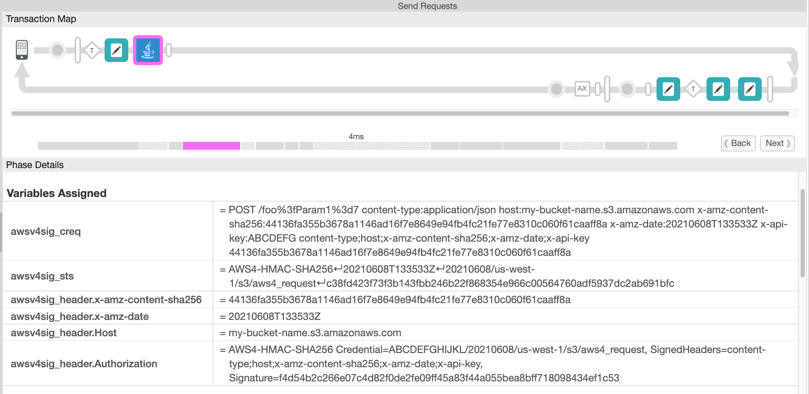

# AWS V4 Signature callout

This directory contains the Java source code for a Java callout for Apigee that
constructs an AWS V4 Signature. The AWS v4 Signature can be used to authenticate
calls into many different AWS resources: Ec2, S3, Lambda, SNS, SQS, and
others. It's the same signature pattern for all of these services. This callout
produces a signature that works with any of these AWS services.

The signature can be used in one of two forms:

- to generate a set of headers (Authorization, x-amz-date, and possibly
  others) on an existing Message in Apigee

- to generate a "presigned URL".

You can use the former to connect directly to an AWS resource from
within Apigee. You can use the latter to generate a signed URL that you
can send from Apigee back to a client (possibly via 302 redirect), which
allows the client to connect directly to the resource.

This Java callout has no dependencies on the AWS SDK; instead it
follows [the described signature process in the AWS Documentation](https://docs.aws.amazon.com/general/latest/gr/sigv4-create-canonical-request.html).

There is a similar callout [available from micovery
here](https://github.com/micovery/apigee-java-callout-aws-signature-v4). The main difference between that one and this one:

* the microvery callout relies on the AWS Java SDK to compute the
  signatures. This is a larger JAR and it may pull in some other
  dependencies. Using this JAR may produce a "heavier" API proxy.

* this callout here relies solely on the JRE to compute the required
  HMACs. There are no additional external dependencies. For that reason
  it may be lighter weight.

Please Note: The callout simply performs the calculations to produce either a
signed URL or a set of headers.  In no case does the callout send out a request
to AWS.  In the case in which you are using the callout to generate headers for
a request to be sent to AWS, the callout only sets headers on a message.  _You
must use ServiceCallout or a target request to actually send the message._

## License

This code is Copyright (c) 2020-2022 Google LLC, and is released under the
Apache Source License v2.0. For information see the [LICENSE](LICENSE) file.

## Disclaimer

This example is not an official Google product, nor is it part of an
official Google product.

## Using the Custom Policy

You do not need to build the Jar in order to use the custom policy.

When you use the policy to generate a signed request, AWS will accept
the authenticated request.


There are two ways to use the policy:

1. to generate a set of headers (Authorization, x-amz-date, and possibly
   others) on an existing Message in Apigee

2. to generate a "presigned URL".

In the first case,
the policy sets the appropriate headers in the AWS request:
- Authorization - with the appropriate signature
- Host - with the endpoint hostname
- x-amz-date - with the appropriate date representing "now"
- (optionally) x-amz-content-sha256

> **NOTE**: the callout does not send the request. It merely sets the headers. Send the request with ServiceCallout! Or via an HTTPTarget.

In the latter case, the policy emits the presigned URL into a context
variable that you specify. Once again, the callout does not invoke that
URL. It merely constructs it. You need to configure the proxy to send that
URL to something that will invoke it.

## Details on Policy Configuration

In all cases, you must configure the policy with your AWS Key and
Secret, as well as the region, the service name, and the endpoint.

## Configuration Case 1 - for Signed Headers

To use signed headers, supply a `source` message.  The policy will
compute the headers and apply them to the specified message.

Example:

```
<JavaCallout name="JC-AWSSignV4">
  <Properties>
    <Property name="service">s3</Property>
    <Property name="endpoint">https://my-bucket-name.s3.amazonaws.com</Property>
    <Property name="region">us-west-1</Property>
    <Property name="key">{private.aws-key}</Property>
    <Property name="secret">{private.aws-secret-key}</Property>
    <Property name="source">outgoingAwsMessage</Property>
    <Property name="sign-content-sha256">true</Property> <!-- optional -->
  </Properties>
  <ClassName>com.google.apigee.callouts.AWSV4Signature</ClassName>
  <ResourceURL>java://apigee-callout-awsv4sig-20210609.jar</ResourceURL>
</JavaCallout>
```

The properties should be self-explanatory.

The `source` should be a Message that you have previously created with `AssignMessage`.

The policy will inject headers: `x-amz-date` and `authorization`, and optionally `host`.

There are optional properties:

* `sign-content-sha256`, when true, tells the policy to add a header
  `x-amz-content-sha256` which holds the SHA256 of the content (payload) for the
  message. The policy also includes that header in the signed headers. Not all
  AWS endpoints require this.

* `insure-trailing-slash`, when true, tells the policy to always insure that the
  URL Path in the canonical request includes a trailing slash. Some endpoints
  apparently require this. For example, suppose your message has
  `/v1/LookupUser` as the path.  If you set the `insure-trailing-slash` to true,
  then the canonical request will use `/v1/LookupUser/` as the path.

The policy then creates an AWS v4 Signature resulting in an Authorization
header. The string-to-sign will include all of the pre-existing headers on
the specified source message, along with the newly injected `x-amz-date` and
`host` and `x-amz-content-sha256` headers.

As an example, for a request like: `POST https://example.amazonaws.com/?Param1=value1`,

...with no payload, and assuming the date is 20150830T123600Z, the resulting Authorization header will have the value:

```
AWS4-HMAC-SHA256
Credential=AKIDEXAMPLE/20150830/us-east-1/service/aws4_request,
SignedHeaders=host;x-amz-date,
Signature=28038455d6de14eafc1f9222cf5aa6f1a96197d7deb8263271d420d138af7f11
```

(All on one line)

This is from a test case provided by Amazon.

For a request with a body, then the resulting Authorization header will likely list additional
headers like `content-type` and `x-amz-content-sha256`.


## Using with ServiceCallout

If you use this callout with ServiceCallout, your flow will look something like this:
```
    <Step>
      <!-- create the message and set the payload -->
      <Name>AM-Construct-Outgoing-AWS-Message</Name>
    </Step>
    <Step>
      <!-- insert the headers required for AWS v4 signature -->
      <Name>JC-AWSSignV4-Outgoing-AWS-Message</Name>
    </Step>
    <Step>
      <!-- send the message with the computed headers -->
      <Name>SC-Send-AWS-Message</Name>
    </Step>
```

The AssignMessage policy will be like this:
```
<AssignMessage name='AM-Construct-Outgoing-AWS-Message'>
  <AssignTo createNew='true' type='request'>outgoingAwsMessage</AssignTo>
  <Set>
    <Headers>
      <!-- per https://docs.aws.amazon.com/kms/latest/APIReference/kms-api-reference.pdf -->
      <Header name="X-Amz-Target">TrentService.Sign</Header>
    </Headers>
    <QueryParams>
      <QueryParam name="Version">2014-11-01</QueryParam>
      <QueryParam name="Action">Sign</QueryParam>
    </QueryParams>
    <Verb>POST</Verb>
    <Payload contentType="application/x-amz-json-1.1">{
      "KeyId": "23c29362-cd00-4c9c-803f-c1ee961be6c3"
      "Message": "ZXlKaGJH....",
      "SigningAlgorithm": "RSASSA_PKCS1_V1_5_SHA_256"
  }</Payload>
  </Set>
</AssignMessage>
```

The configuration for this custom Java policy might look like this:
```
<JavaCallout name="JC-AWSSignV4">
  <Properties>
    <Property name="service">kms</Property>
    <Property name="endpoint">https://kms.us-east-1.amazonaws.com</Property>
    <Property name="region">us-east-1</Property>
    <Property name="key">{private.aws-key}</Property>
    <Property name="secret">{private.aws-secret-key}</Property>
    <Property name="source">outgoingAwsMessage</Property>
    <Property name="sign-content-sha256">true</Property>
  </Properties>
  <ClassName>com.google.apigee.callouts.AWSV4Signature</ClassName>
  <ResourceURL>java://apigee-callout-awsv4sig-20210609.jar</ResourceURL>
</JavaCallout>
```

And the ServiceCallout policy will look like this:
```
<ServiceCallout name="SC-Send-AWS-Message">
  <Request variable='outgoingAwsMessage'/>
  <Response>awsresponse</Response>
  <HTTPTargetConnection>
    <!-- do not include query params here -->
    <URL>https://kms.us-east-1.amazonaws.com</URL>
  </HTTPTargetConnection>
</ServiceCallout>
```


### Note about the Headers that get set

The policy will set headers,  including `x-amz-date`, `host`, `authorization`, and
optionally `x-amz-content-sha256`, in the source message.

If you use Apigee trace, you will not see these values as they are set directly
on the source message; this is a limitation of Apigee trace. The policy sets
"shadow" context variables for all of the generated headers that contain
non-sensitive information, including `x-amz-date`, `x-amz-content-sha256` and
`host`. The names of the variables are like `awsv4sig_header.HEADERNAME`. These
context variables get the same respective values as the actual headers on the
message; they're set only for diagnostic purposes.

As noted above, The policy sets the `authorization` header to contain the generated
AWSv4 Authorization header for the given request. By default you will not be
able to see this value.

If you specify the `debug` property as `true`, then the callout includes the
`Authorization` header in the list of headers that get "shadowed" with context
variables.

By default the callout does not emit the `Authorization` header into
a distinct context variable, because it is sensitive information and it's better not to
display that in Apigee Trace. In all cases, the callout will apply that value
into the Authorization header of the designated "source" message.

### Other Context Variables

The policy also sets other context variables, containing intermediate results
from its operation; this is for diagnostic purposes only. These variables
include:

| variable       | description |
| -------------- | ----------- |
| awsv4sig\_creq | the canonicalized request string |
| awsv4sig\_sts  | the "string to sign". In place of newlines, this string uses the ↵ character, for diagnostic purposes only. The actual string-to-sign uses newlines. |

A view of these in the Trace UI:



### This callout does not send the request

This callout does not send out the request. Instead you should use
ServiceCallout for that purpose. In the ServiceCallout configuration,
refer to the same message you used as `source` in the Java callout.

For example, if you had this in your Java callout:
```
        <Property name="source">outgoingAwsMessage</Property>
```

Then your ServiceCallout should look something like this:
```xml
<ServiceCallout name='SC-PUT-to-S3'>
  <!-- specify the previously-created message here -->
  <Request clearPayload="false" variable="outgoingAwsMessage">
     <!--
       No need to set headers now, after signature calculation.
       The following headers were already set by the Java callout:
         x-amz-date, host, authorization, and x-amz-content-sha256
     -->
  </Request>
  <Response>uploadResponse</Response>
  <HTTPTargetConnection>
    <SSLInfo>
      <Enabled>true</Enabled>
      <IgnoreValidationErrors>false</IgnoreValidationErrors>
      <TrustStore>mytruststore</TrustStore>
    </SSLInfo>
    <URL>https://{endpoint}/{bucket}/{filename}</URL>
  </HTTPTargetConnection>
</ServiceCallout>
```

This assumes that prior to the Java callout, you used an AssignMessage to create the
message named `outgoingAwsMessage` and set the verb, payload, and content-type on that message.


## Configuration Case 2 - for Pre-Signed URL

To generate a pre-signed URL, do not specify a `source`
message. Instead, specify these properties:

* request-verb
* request-path
* request-expiry
* output

The policy will compute the pre-signed URL and place it into the context variable you specify with the output property.

Example:

```
<JavaCallout name="JC-AWSSignV4-PresignedUrl">
  <Properties>
    <Property name="service">s3</Property>
    <Property name="endpoint">https://my-bucket-name.s3.amazonaws.com</Property>
    <Property name="region">us-west-1</Property>
    <Property name="key">{private.aws-key}</Property>
    <Property name="secret">{private.aws-secret-key}</Property>
    <Property name="request-verb">GET</Property>
    <Property name="request-path">/path-to-object.txt</Property>
    <Property name="request-expiry">86400</Property> <!-- in seconds -->
    <Property name="output">my_context_var</Property>
  </Properties>
  <ClassName>com.google.apigee.callouts.AWSV4Signature</ClassName>
  <ResourceURL>java://apigee-callout-awsv4sig-20210609.jar</ResourceURL>
</JavaCallout>
```

The policy will generate a presigned URL that matches what is given in the example [in the AWS S3 documentation](https://docs.aws.amazon.com/AmazonS3/latest/API/sigv4-query-string-auth.html).


## Using the Example bundle

Import the Example API proxy bundle into your organization, and deploy it into your environment.

Then, enable trace, and invoke it with curl:
```
# For Apigee Edge
endpoint=https://${ORG}-${ENV}.apigee.net

# For Apigee X
endpoint=https://your-endpoint-will-vary.net
curl -i $endpoint/awsv4test/t1
```

You should see in the Trace, the output values for sts and creq.

Now try the test case I mentioned above:

```
curl -i $endpoint/awsv4test/post-vanilla-empty-query-value
```

You should see in trace, the sts, the creq, as well as the value for the authorization header. It should be:
```
AWS4-HMAC-SHA256
Credential=AKIDEXAMPLE/20150830/us-east-1/service/aws4_request,
SignedHeaders=host;x-amz-date,
Signature=28038455d6de14eafc1f9222cf5aa6f1a96197d7deb8263271d420d138af7f11
```
(all on one line)

## No Dependencies

There are no dependencies of this callout jar, other than the Java runtime.

## Building the Jar

You do not need to build the Jar in order to use the custom policy. The custom policy is
ready to use, with policy configuration. You need to re-build the jar only if you want
to modify the behavior of the custom policy. Before you do that, be sure you understand
all the configuration options - the policy may be usable for you without modification.

If you do wish to build the jar, you can use
[maven](https://maven.apache.org/download.cgi) to do so. The build requires
JDK8. Before you run the build the first time, you need to download the Apigee
Edge dependencies into your local maven repo.

Preparation, first time only: `./buildsetup.sh`

To build: `mvn clean package`

The Jar source code includes tests.

If you edit policies offline, copy [the jar file for the custom
policy](callout/target/apigee-callout-awsv4sig-20210609.jar) to your
apiproxy/resources/java directory.  If you don't edit proxy bundles offline,
upload that jar file into the API Proxy via the Apigee API Proxy Editor .

## Bugs

1. There are no end-to-end tests that actually connect with an AWS endpoint.
   The tests work only on test vectors provided previously by AWS.


## Author

Dino Chiesa    
godino@google.com
